# NYC POI Concierge - System Architecture

This document describes the architecture of the NYC POI Concierge application as implemented for the hackathon. It features a **Hybrid Architecture** where the mobile app communicates via an HTTP Bridge to the MCP tools, while the core logic remains MCP-compliant.

## 🏗️ High-Level Architecture

```mermaid
graph TD
    %% Mobile Frontend
    subgraph Mobile ["📱 Mobile App (Expo)"]
        UI[React Native UI]
        Loc[Location Service]
        Weather[Weather Service]
        API_Client[API Client]
    end

    %% Backend Layer
    subgraph Backend ["🚀 Backend (MCP Server)"]
        HTTPServer[FastAPI HTTP Bridge]
        Orchestrator[MCP Tool Orchestrator]
        
        subgraph Tools ["MCP Tools"]
            Query[query_pois]
            Recs[get_contextual_recommendations]
        end
    end

    %% External Services
    subgraph Cloud ["☁️ Cloud Services"]
        Mongo[(MongoDB Atlas\nGeo + Vector)]
        Tavily[Tavily AI\nReal-time Enrichment]
        OpenAI[OpenAI GPT-4o\nIntelligence]
        OWM[OpenWeatherMap]
    end

    %% Data Flow
    UI -->|User Action| API_Client
    Loc -->|GPS Coords| API_Client
    Weather -->|Conditions| API_Client
    
    API_Client -->|POST /query-pois| HTTPServer
    API_Client -->|POST /recommendations| HTTPServer
    
    HTTPServer -->|Invoke| Orchestrator
    Orchestrator -->|Execute| Query
    Orchestrator -->|Execute| Recs
    
    Query -->|Find| Mongo
    Recs -->|Reason| OpenAI
    Recs -->|Enrich| Tavily
    
    Weather -.->|Fetch| OWM
```



## 🧩 Key Components

### 1. Mobile Client (`frontend/expo-app`)
- **Framework**: React Native with Expo.
- **Role**: User interface for discovery and chat.
- **Services**:
  - `LocationService`: Manages GPS and permissions.
  - `WeatherService`: Fetches real-time context from OpenWeatherMap.
  - `MCPService`: Communicates with the backend via HTTP REST endpoints.

### 2. Backend Server (`backend/mcp-server`)
- **Core**: Python-based MCP Server implementing the Model Context Protocol.
- **HTTP Bridge (`http_server.py`)**: A FastAPI wrapper that exposes MCP tools as REST endpoints (`/query-pois`, `/recommendations`) for the mobile app.
- **Tools**:
  - `query_pois`: Handles geospatial MongoDB queries with prestige filtering.
  - `get_contextual_recommendations`: Uses GPT-4o to generate personalized suggestions based on context (weather, time, occasion).

### 3. Data & Intelligence
- **MongoDB Atlas**: Primary data store.
  - **Geospatial Index**: For "near me" queries.
  - **Vector Index**: For semantic search (ready for embeddings).
- **Tavily**: Used for real-time POI discovery and validation during curation.
- **OpenAI**: Powers the reasoning engine for recommendations and chat.

## 📂 Project Structure

```
nyc-poi/
├── backend/mcp-server/      # Python Backend
│   ├── src/tools/           # MCP Tool logic
│   ├── http_server.py       # FastAPI Bridge
│   └── server.py            # Standard MCP Entrypoint
│
├── frontend/expo-app/       # Mobile App
│   ├── app/(tabs)/          # Screens
│   └── services/            # API Integrations
│
├── scripts/                 # Data Pipelines
│   ├── data_pipeline/       # MongoDB Imports
│   ├── tavily_curation/     # Discovery Bots
│   └── verification/        # Quality Checks
│
└── data/                    # Datasets
    ├── curated/             # Production Data
    └── raw/                 # Discovery Output
```

## 🔄 Data Flow: "Find a date night spot"

1.  **Mobile App**: Captures user location (`40.75, -73.98`) and weather (`Rainy`).
2.  **Request**: Sends `POST /recommendations` to Backend with context.
3.  **Backend**:
    *   **Tool**: Calls `get_contextual_recommendations`.
    *   **Search**: Queries MongoDB for candidates near location.
    *   **Reasoning**: GPT-4o filters candidates: *"Since it's rainy, prefer cozy indoor spots like Le Bernardin over rooftop bars."*
4.  **Response**: Returns ranked list with "Why this fits" explanations.
5.  **UI**: Renders cards with "Rainy Day Pick" badges.
